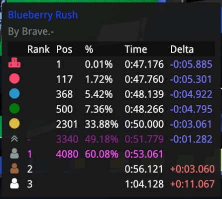

# Local Records

A Trackmania plugin adding a leaderboard for local records.

## Main Features
- **Record History**: A table containing your previous and best times, not just your personal best.
- **Medals**: Support for all common medals.
- **Your Potential**: Integration of no-respawn and best-checkpoint times. Shows the potential global position.
- **Comparisons**: Detailed comparison of checkpoints and laps. Available for your own records and the AT.
- **Customization**: Displaying exactly the information you want. Filtering and sorting of rows and columns. Creation of custom times and positions.

## License
LocalRecords is licensed under the [Apache-2.0 license](./LICENSE).

## Dependencies
The following plugins are required for using LocalRecords:
- [MLFeed](https://openplanet.dev/plugin/mlfeedracedata) - Provides race data
- [MLHook](https://openplanet.dev/plugin/mlhook) - Enables AT checkpoint times

Furthermore these plugins can be installed for additional features:
- [Champion Medals](https://openplanet.dev/plugin/championmedals) - Adds an entry for the Champion medal
- [Warrior Medals](https://openplanet.dev/plugin/warriormedals) - Adds an entry for the Warrior medal
- [Map Info](https://openplanet.dev/plugin/mapinfo) - Enables the percentage of players

## Credits

The following awesome plugins helped me to find inspirations and implementations:
- [ExtraLeaderboardPositions](https://openplanet.dev/plugin/extraleaderboardpositions) - Inspiration for the general idea of the plugin
- [UltimateMedalsExtended](https://openplanet.dev/plugin/ultimatemedalsextended) - Idea of displaying copium times
- [Best Checkpoints](https://openplanet.dev/plugin/bestcheckpoints) - Idea for showing checkpoint/lap times
- [Author Time Check](https://openplanet.dev/plugin/authortimecheck) - Code for retrieving the author checkpoint times

## Development

The [dev](./dev/) directory provides scripts to build and install the plugin on Windows and Linux.
These can be used by running `./dev/build.[ps1|sh]` from the project's root directory.
Currently the scripts assume that the Trackmania plugins are located at `~\OpenplanetNext\Plugins"` for Windows and at `~/.local/share/Steam/steamapps/compatdata/2225070/pfx/drive_c/users/steamuser/OpenplanetNext/Plugins"` on Linux machines.
The installation can be disabled by using `--no-install`, and installs to a directory with a `-dev` suffix so it doesn't collide with the live plugin.

For testing migrations, the live version's data can be copied into the dev plugin's data directory with `--copy-data`, and removed again with `--delete-data`. The live data is never modified by either flag.

The [.clang-format](./.clang-format) file provides code styles.
